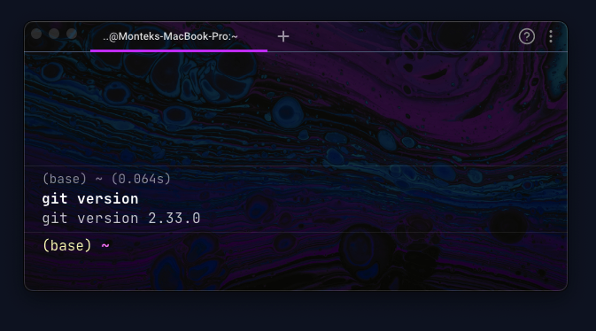
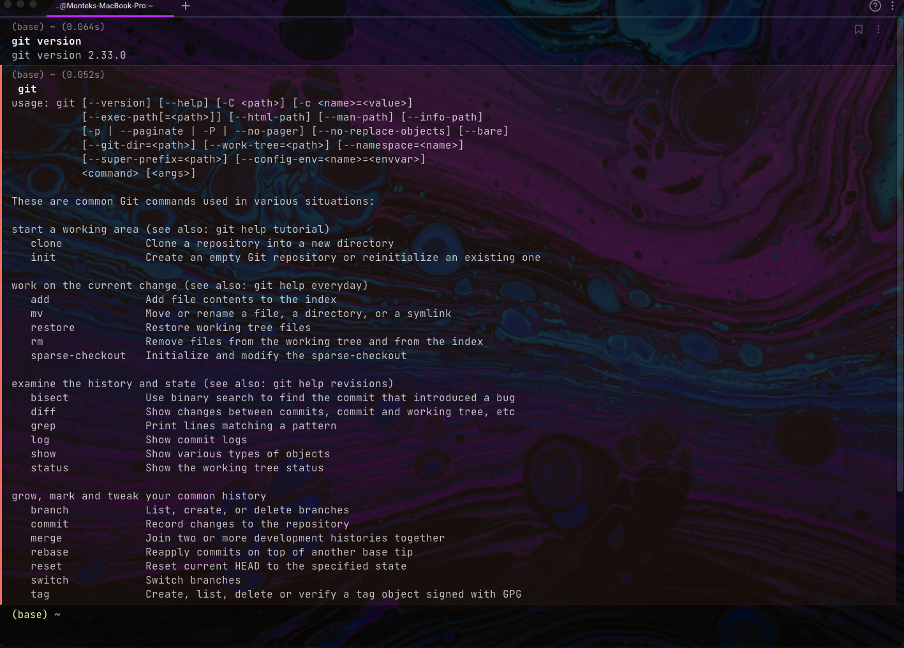
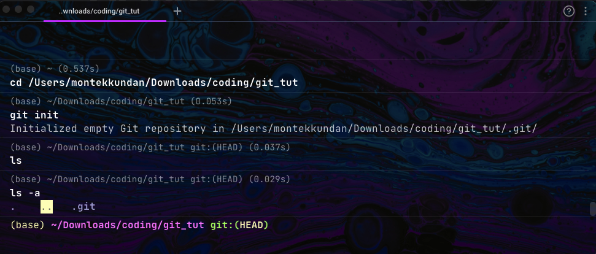
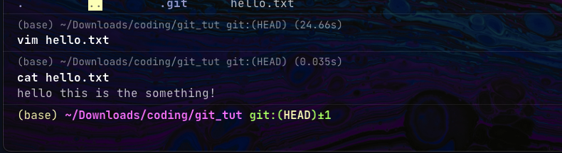
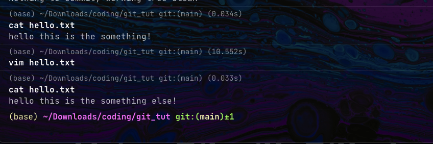

Hi! I'll guess you're here to learn about Git and Github, ofcourse right that's why you clicked at my log! I'll introduce and share everything I've learned about Git and Github with you (the reader) and will keep updating this log every time I learn something new from my daily use or from your suggestions and feedback. Okay lets dive into this now shall we!

# Table of Contents
- [Table of Contents](#table-of-contents)
- [What is Git](#what-is-git)
- [What is Github](#what-is-github)
- [Working with Git](#working-with-git)
  - [Installing Git](#installing-git)
  - [Basic Git commands](#basic-git-commands)
  - [Git Clone, Git Init](#git-clone-git-init)
  - [Git Add, Git Commit!](#git-add-git-commit)
- [Working with Github](#working-with-github)
- [Using Git with Github](#using-git-with-github)
- [Github Desktop](#github-desktop)

# What is Git

Git is a version control system. Yup thats it! Now you know what git is, just kiding! It's a lot more than just three words. So know lets take an example and learn what Git is. Suppose you and you friend (if you have one, if not then assume me as your new friend!) are making a new browser which will change how everyone uses browsers. You and your friend have the idea and the knwoledge to create something new. Now lets see, you created the base code for the browser. I don't know how you coded it but you made it work. That's great now you want your friend to make fixes to anything he finds missing or wrong in the code. Just to clear the code you wrote is huge, about 250gb! I know you can't code this much but for the sake of the example lets assume it.
Now you sent your friend the code of 250gb by some means and she/he downloaded it. Your friend now fixes and adds stuff which makes the file size of about 300gb which is 50gb more than before! You get the file and now you face an issue, why do you have 2 copies of the code one old and one new and both taking their individual spaces (250 + 300 = 500gb).

To solve this problem Git was created by Linus Torvalds

There were other version control systems before too! But Git is widely popular and should be known by a developer(if you are).

If you are interested in the history of Git and why how it was made read it <a href="https://www.geeksforgeeks.org/history-of-git/" target="_blank">here</a>.


<a href="#top" style="text-decoration:none;">go to top ☝️</a>


# What is Github

Now git is a graphical representation of Git, in a way. It lets you host your own repositories (folders of code) on Github. By **host** I mean is to put your code in Github in your account for free so that others people can work with you.

You can learn more about Github from their <a href="https://github.com/" target="_blank">website</a>.

<a href="#top" style="text-decoration:none;">go to top ☝️</a>


# Working with Git

Okay lots of theory stuff now lets get practical, lets see how Git works and what it really is.

 **Note: You are not forced to use Git you can also use other verison control systems out there like Apache Subversion, Concurrent Versions System etc. We are learning git because it is popular.**

## Installing Git

You can install Git on your desired operating system from <a href="https://git-scm.com/downloads" target="_blank">here</a>.

Now if you type `git version` you should see your git version which is installed.

</img>

BTW I am using mac system and the termianl which I am using is <a href="https://app.warp.dev/referral/2KG4N3" target="_blank">Warp</a>.

## Basic Git commands

Now try typing `git` in your terminal you will see this:

</img>

This shows all the commands you can use with Git. Great isn't it?! Similarly you can type `git --help` to get the similar results as above.

These are all the flags ( the words which we put after writing git to do a specific task) Git provides us with.

```shell
usage: git [--version] [--help] [-C <path>] [-c <name>=<value>]
           [--exec-path[=<path>]] [--html-path] [--man-path] [--info-path]
           [-p | --paginate | -P | --no-pager] [--no-replace-objects] [--bare]
           [--git-dir=<path>] [--work-tree=<path>] [--namespace=<name>]
           [--super-prefix=<path>] [--config-env=<name>=<envvar>]
           <command> [<args>]
```

We won't be using every flag but only the common ones which is widely used.


## Git Clone, Git Init

We use `git clone` to clone a repository into a new directory. Now here repository is the Github repository, which Github allows us to host on their website. To use this command we have to type:
<pre>git clone https://github.com/url </pre>

here the url is from the github repository you want to clone. Clone means exactly like the word, you clone or copy the code in the repository (or code folder) in your system. The code in the Github repository will be cloned(copied) and then will be added(pasted) in your system folder.

We will see more of this command in [Using Git with Github](#using-git-with-github)

We use `git init` to initialize a git folder in the particular folder we are using this command in. This command creates a hidden folder which starts with a `.`(dot). This hidden folder is not normally visible throught file explorer(windows) or finder(mac). The folder created is `.git`. To view the folder we have to allow the view for hidden files.

We really don't have to change anything from `.git` folder it just helps us to keep record of evey changes we do, who changes it and other cool things!

## Git Add, Git Commit!

Now lets implement the most used and basic Git command. For this follow these simple steps first:

- Create a folder. (anywhere you like)
- Open the folder in your favourite terminal.
- type `git init` to initialize a git repository.

All done for the initial setup!

</img>

As you can see normally we cannot view the `.git` folder. But when we list all the files including the hidden files we see our `.git` folder.

Now if you have followed along, lets start. Create a text file in that folder and type anything as the content.

</img>

I have made a file named `hello.txt` and added the content as `hello this is something!`

Now type `git status` you will see the file is in red, as we have not added this file in git.


Now lets add this file to git using `git add .`. Here we used `.` (dot) to add every file that exists in the repository(folder). To add a particular file we can use `git add filename`.

After adding lets agian type `git status` the file now staged in our git. It will be now monitored by git for us. HOLD UP! We have yet to tell git to monitor it!
First we have to commit the changes which means we are sure that this is the file to be monitored by git for any changes in future!

We will now commit the change with the command `git commit -m "inital commit"` here the `-m` represent the message we want the commit to have when the file is committed so that later when we have lots of commit changes we can recognize a particular commit with our message! Great, also you can write any message here, i wrote `inital commit` as it is my first commit.


Now if you try looking at our status with `git status` you will see that our working tree is clean! Thats good as nothing is changed in our file. Now lets change few words in our file which we created and committed just now.

</img>

As you can see I added `else` at the end of the statement. Now lets see our status by using the command `git status`. We can see that we get our file is modified.

We can now repeat the same add and commit process to keep a log of our changes.

Try doing few changes and commit then do add them before commiting!

If you want to see how many commits you have made try typing `git log` in your terminal, you will see all the commits with their messages.

Now this is just the basics we will learn more about reverting to previous commits and changing our commits messages later in an advanced log!

<a href="#top" style="text-decoration:none;">go to top ☝️</a>
# Working with Github
<a href="#top" style="text-decoration:none;">go to top ☝️</a>
# Using Git with Github
<a href="#top" style="text-decoration:none;">go to top ☝️</a>
# Github Desktop
<a href="#top" style="text-decoration:none;">go to top ☝️</a>


